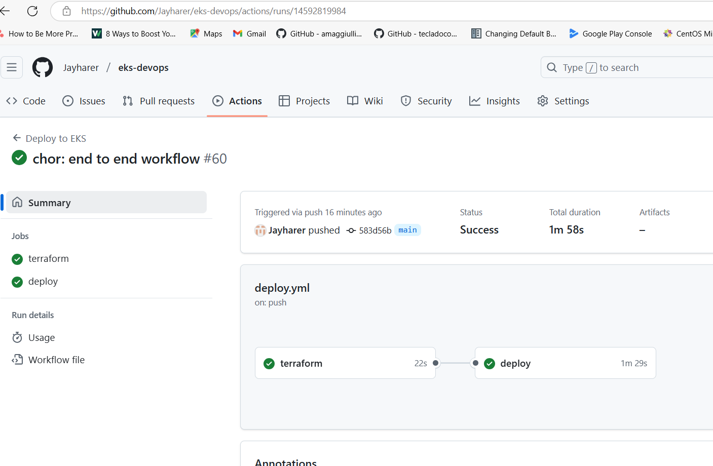
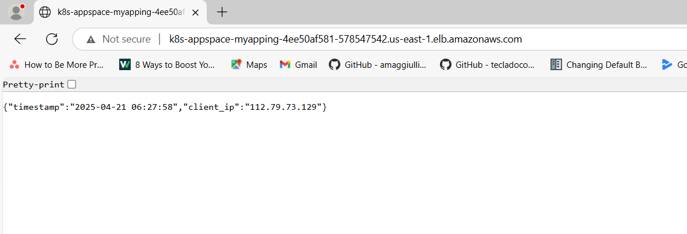

# particle41-devops

## Tools Used
1. AWS Cloud
2. Github Actions
3. Terraform
4. Git
5. Python
6. aws-cli
7. eksctl
9. Kubectl
---

## Installation

### 1. Create IAM user
```
Inside AWS Console -  

step1:
    IF you have admin User in account:
        Use existing admin user
        Update Admin user arn in terraform/terraform.tfvars file
        of variable AWS_ADMIN_USER_ARN.
    Else:
        Create IAM user jay , assign AdminFull access
        Update Admin user variable AWS_ADMIN_USER_ARN in terraform/terraform.tfvars file

step2:
    create access and secret key for above user.

step3:
    create s3 bucket(name=custom-s3-bucket-name)
```

### 2. Update **terraform/backend.tf** with
```
bucket = "custom-s3-bucket-name"
```

### 3. Clone repo
```bash
git clone https://gitlab.com/jay416505/eks-devops.git
```

### 4. Create new repo in Github and Configure Following secrets in GithubActions as new repository secrets 
```
AWS_ACCESS_KEY_ID
AWS_SECRET_ACCESS_KEY
AWS_REGION
AWS_ACCOUNT_ID
AWS_EKS_NAME
ECR_REPO_NAME
```

### 5. Push changes to new Github repo
```bash
cd eks-devops
git remote remove origin
git remote add origin "<https-url-of-your-new-git-remote-repo>"
git branch -M main
git push -uf origin main
```
### 6. Afetr successful deployment check Github Action Result


### 7. Afetr successful deployment check AWS alb url in browser


### 8. Clean up, terraform destroy & manually delete alb from aws console 
```bash
cd terraform
terraform destroy
```


